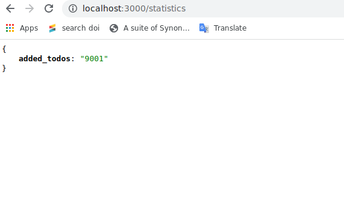
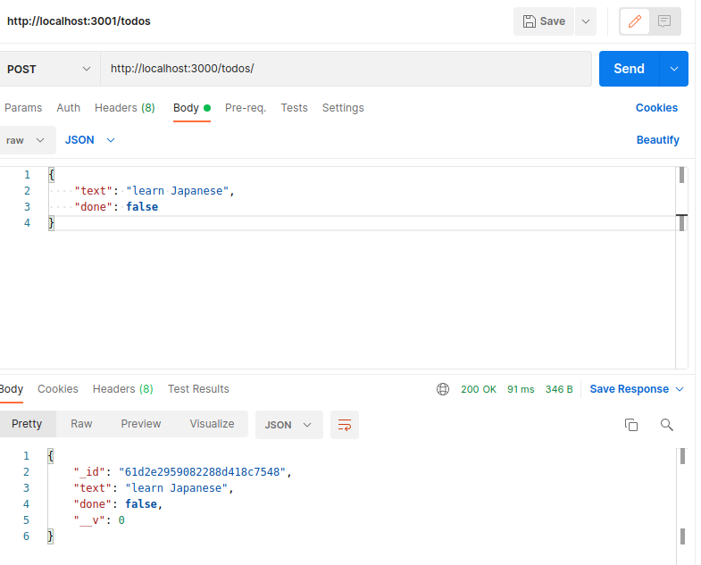
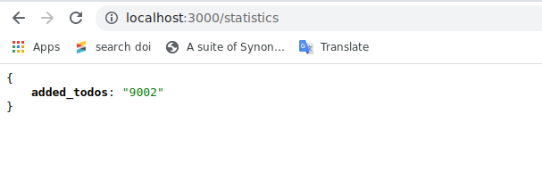
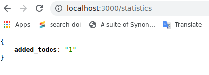
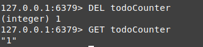

### Start a redis container
``docker-compose -f docker-compose.dev.yml up`

### Shell into the redis container open redis cli
```
docker exec -it cabe76c6eb93 bash
redis-cli
```

### List all keys
`KEYS *`

In my case, there is only one key "todoCounter":
```
127.0.0.1:6379> KEYS *
1) "todoCounter"
```

### Check the value of the key
`GET todoCounter`

This command returns
```
127.0.0.1:6379> GET todoCounter
"1"
```

### Set the value of the counter to 9001
`SET todoCounter 9001`

This value can be seen from the application:



### Create a new todo with Postman


The counter_value also increased in the application:



### Delete the key from cli
`DEL todoCounter`

After adding a new todo, the value of "todoCounter" key becomes 1:





