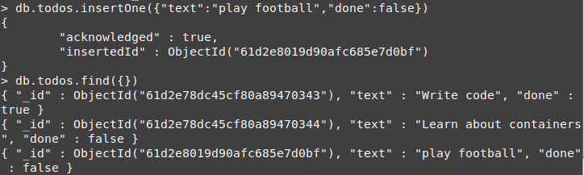

### Start a mongo container
`docker-compose -f docker-compose.dev.yml up`

### Shell into the mongo container
`docker exec -it efaf706fc990 bash`

### Open mongo CLI and switch to the correct database
```
mongo -u root -p example
use the_database
```
### Insert a new todo item
`db.todos.insertOne({"text":"play football","done":false})`

### Ensure that the new todo has been inserted
`db.todos.find({})`


